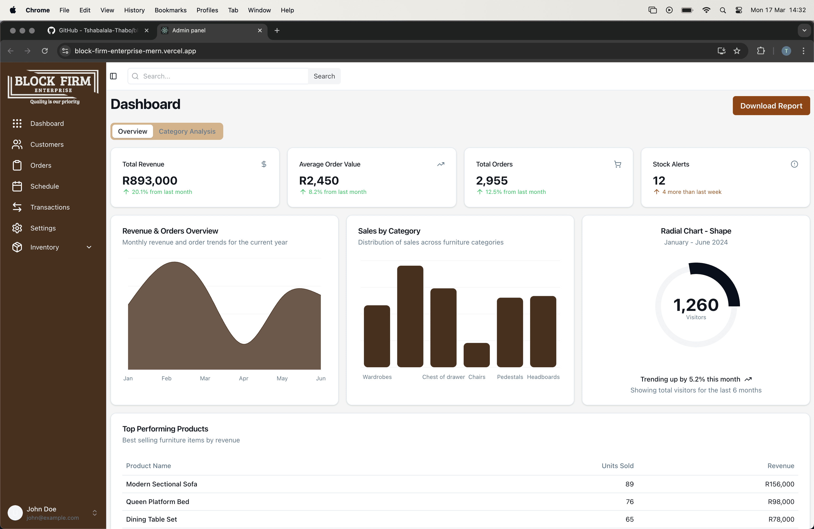

# Block Firm Enterprise - Admin Dashboard

This repository contains the admin dashboard for **Block Firm Enterprise**, a furniture and carpentry company. The dashboard is currently in development and will evolve into a fully functional management system.

## 🖼️ Screenshot


## 📌 Features
- 📊 Sales and revenue tracking
- 📈 Interactive charts for analytics
- 📦 Stock alerts and product performance insights
- 🛒 Order management
- 🏢 Category analysis

## 📁 Project Structure
```
block-firm-enterprise/
├── admin-panel/     # Dashboard source code
│   ├── components/  # Reusable UI components
│   ├── pages/       # Dashboard pages
│   ├── public/      # Static assets
│   ├── styles/      # Styling files
│   ├── utils/       # Helper functions
│   └── ...         
└── README.md        # Project documentation
```

## 🚀 Getting Started

### 1️⃣ Prerequisites
Make sure you have the following installed:
- [Node.js](https://nodejs.org/) (LTS recommended)
- [Yarn](https://yarnpkg.com/) or npm

### 2️⃣ Installation
```sh
# Clone the repository
git clone https://github.com/your-username/block-firm-enterprise.git

# Navigate to the admin panel directory
cd block-firm-enterprise/admin-panel

# Install dependencies
yarn install  # or npm install
```

### 3️⃣ Running the Dashboard
```sh
# Start the development server
yarn dev  # or npm run dev
```
The dashboard should now be accessible at `http://localhost:3000/`.

## 📌 Roadmap
- 🔜 Add user authentication
- 🔜 Implement role-based access control
- 🔜 Integrate backend APIs
- 🔜 Enhance UI/UX

## 🤝 Contribution
Contributions are welcome! Feel free to submit issues and pull requests.

## 📄 License
This project is licensed under the MIT License.

---
Made with ❤️ by Block Firm Enterprise.

